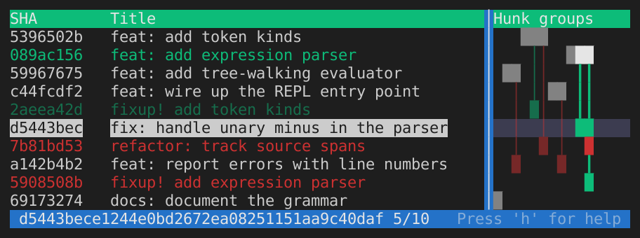

# git-tailor


An interactive terminal tool for tidying up Git commits on a branch — squash,
reorder, split, drop, and reword commits before submitting a pull request or
pushing to a shared branch.

The left panel shows your commits. The right panel shows a **hunk group matrix**
— a visual aid that instantly reveals which commits touch the same lines of
code, and whether combining them would be safe or risky.

> **⚠ Data safety — please read before use**
> 
> This tool rewrites history. Always push your branch to a remote before running
> it. The author takes **no responsibility** for data loss of any kind. Use at
> your own risk. See [LICENSE](LICENSE) for the full disclaimer.
> 
> This tool was developed entirely through AI-assisted ("vibe coded") sessions
> using AI agents. It has been reviewed and tested, but may contain bugs.


## Installation

```sh
cargo install --locked git-tailor
```

Requires Rust 1.85 or later.


## Usage

```sh
gt [base]
```

`[base]` identifies the branch or point you forked from — typically the target
branch of your pull request (e.g. `main` or `origin/main`). It does not need to
be a direct ancestor of `HEAD`: the **merge-base** (common ancestor) between
`[base]` and `HEAD` is used as the reference point. All commits between that
merge-base and `HEAD` are shown.

When `[base]` is omitted, `gt` automatically uses the repository's default
upstream branch by resolving `origin/HEAD`. If that is not configured it falls
back to `main`.

```sh
gt main              # commits on top of main
gt origin/main       # commits not yet pushed
gt v1.2.3            # commits since a tag
gt                   # auto-detect default branch (origin/HEAD or main)
```

**Flags:**

| Flag                 | Description                                                                        |
|----------------------|------------------------------------------------------------------------------------|
| `--reverse` / `-r`   | Show oldest commit at the top                                                      |
| `--full` / `-f`      | Show every raw hunk group column without deduplication                             |
| `--all`              | Browse the complete repository history from HEAD down to the root commit           |
| `--static` / `-s`    | Print the hunk group matrix to stdout and exit (no TUI)                            |
| `--no-color`         | Disable colors in `--static` output                                                |
| `--squashable-scope` | Controls whether yellow connectors mean per-hunk-group or per-commit squashability |
| `--theme <THEME>`    | Hunk group matrix rendering theme: `plain` (default), `highlight`, or `classic`    |

Some flags can be persisted via environment variables so you don't have to pass
them every time:

| Environment variable              | Equivalent flag                     |
|-----------------------------------|-------------------------------------|
| `GT_REVERSE=1`                    | `--reverse`                         |
| `GT_FULL=1`                       | `--full`                            |
| `GT_SQUASHABLE_SCOPE=hunk-group`  | `--squashable-scope hunk-group`     |
| `GT_THEME=highlight`              | `--theme highlight`                 |


## The interface



Each **column** in the hunk group matrix represents a group of related hunks (a
contiguous set of lines in a file that is touched by one or more commits). A
square `█` in a column means that commit modifies lines in that hunk group. A
vertical line `│` between two squares is a **connector** — it means the two
commits touch the same hunk group but are separated by other commits.

### Color legend — hunk group matrix (plain theme)

| Color            | Meaning                                                                                                                |
|------------------|------------------------------------------------------------------------------------------------------------------------|
| White square     | This commit touches a hunk group that also appears in another commit — potential conflict                              |
| Dark gray square | This commit's changes in this hunk group can be cleanly squashed with the related, earlier commit                      |
| Yellow connector | From dark gray square, the two commits can be cleanly squashed                                                         |
| Red connector    | The two commits touching this hunk group have **conflicting** changes, reordering or squashing risks a merge conflict  |

Note that even though the colors indicate cleanly squashable, git may consider
the squash causing conflict since git-tailor considers no extra lines of context
while git does.

### Color legend — commit list (plain theme)

When you select a commit, the other commits are colored relative to it:

| Color     | Meaning                                                                                                                           |
|-----------|-----------------------------------------------------------------------------------------------------------------------------------|
| Yellow    | Squashable partner — the currently selected commit can be cleanly squashed into the yellow or vice versa depending on order       |
| Red       | Conflicting — the currently selected commit touches the same lines as the red commit; squashing or reordering may cause conflicts |
| Dark gray | Fully squashable — every hunk group the grey commit touches is squashable; a good candidate to merge into another commit          |
| Normal    | No shared hunk groups with the currently selected commit                                                                          |


## Key bindings

### Navigation

| Key                  | Action                              |
|----------------------|-------------------------------------|
| `↑` / `↓`, `j` / `k` | Move selection up/down              |
| `PgUp` / `PgDn`      | Move one page up/down               |
| `←` / `→`            | Scroll hunk group matrix left/right |
| `Ctrl ←` / `Ctrl →`  | Move the panel separator left/right |

### Operations

| Key | Action                                                                            |
|-----|-----------------------------------------------------------------------------------|
| `s` | **Squash** — merge the selected commit into an earlier one, message can be edited |
| `f` | **Fixup** — like squash, but discards the selected commit's message               |
| `m` | **Move** — pick a new position for the selected commit                            |
| `p` | **Split** — divide the selected commit into smaller commits                       |
| `r` | **Reword** — edit the commit message                                              |
| `d` | **Drop** — delete the selected commit entirely                                    |

### Views and other

| Key           | Action                           |
|---------------|----------------------------------|
| `Enter` / `i` | Toggle commit detail view (diff) |
| `h`           | Show help dialog                 |
| `u`           | Refresh commit list from HEAD    |
| `Esc` / `q`   | Close dialog / quit              |

### Search (commit detail view)

| Key   | Action                              |
|-------|-------------------------------------|
| `/`   | Open search bar (regex)             |
| `n`   | Jump to next match                  |
| `N`   | Jump to previous match              |
| `Esc` | Dismiss search                      |


## Attribution

Git-tailor is inspired by [tig](https://github.com/jonas/tig) and
[fragmap](https://github.com/amollberg/fragmap).

The source code of **fragmap** has been used by AI agents to produce code for
this tool — it is derived from or inspired by fragmap, which is licensed under
the Apache License, Version 2.0.

See [NOTICE](NOTICE) for full details.


## License

Apache License, Version 2.0 — see [LICENSE](LICENSE).

## Changelog

See [CHANGELOG.md](CHANGELOG.md) for a history of notable changes.
